### Logowanie do programu

* * *

 [1]

Otwórz swoją ulubioną przeglądarkę i wpisz adres strony.

 [2]

Ikona "kategoryzacja pielęgniarska" znajduję sie na "zawartości".  Można ją skopiować na pulpit.

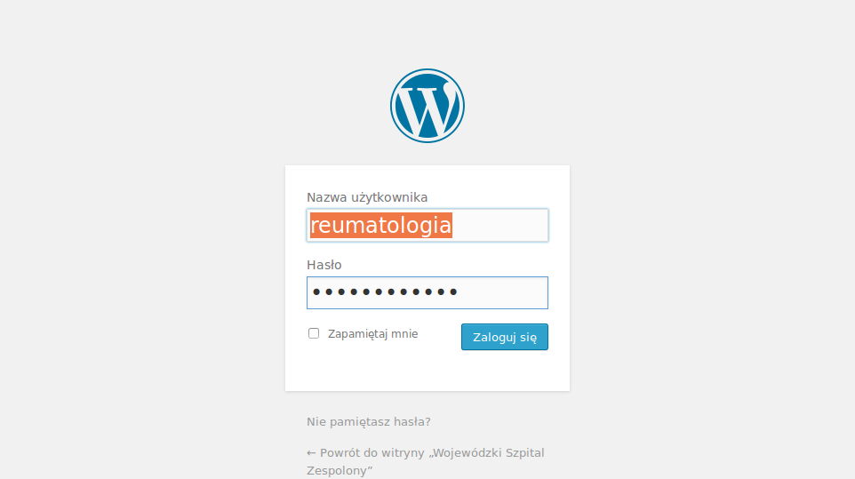 [3]

Wpisz nazwę użytkownika i hasło. Kliknij przycisk.

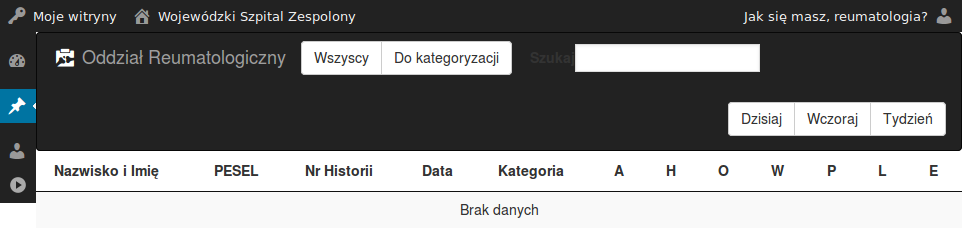 [4]

Ciesz się programem.

Uwaga!: Pamiętaj by ustawić bezpieczne hasło dostępu.
Zmieniaj hasła nie rzadziej niż raz na dekadę ;)

### Wylogowanie z programu

* * *
 [5]Najedź na menu w prawym górnym rogu ekranu. 
Kliknij w odpowiednią opcję.

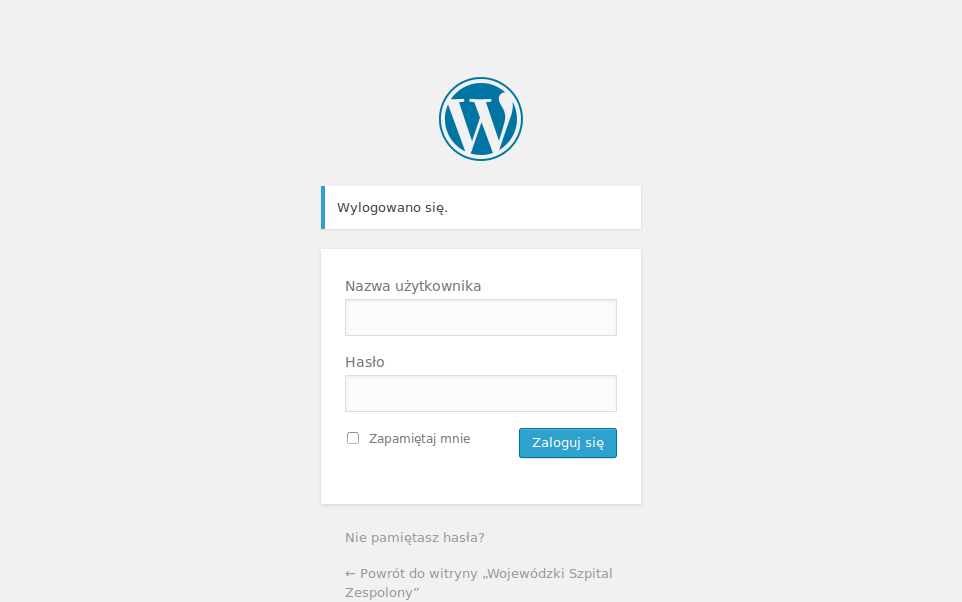 [6]Pojawi się informacja o wylogowaniu.

### Zmiana hasła
* * *
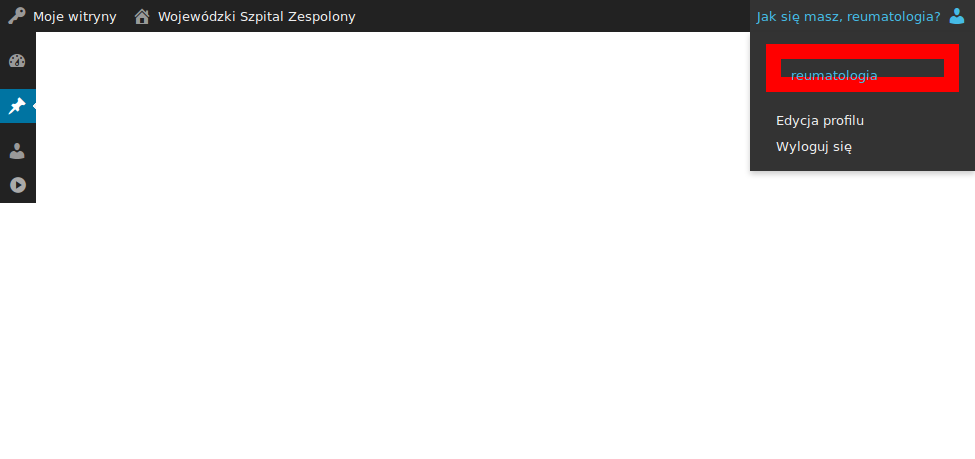 [7]Najedź na menu w prawym górnym rogu ekranu. 
Kliknij profil.

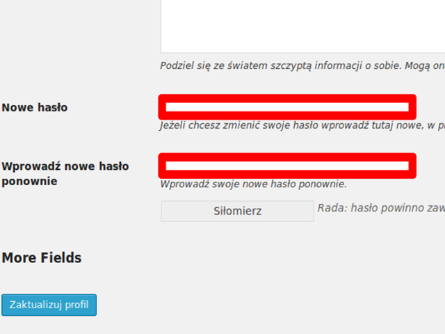 [8]Przejdź niżej do pól zmiany hasła. 
Wpisz hasło dwukrotnie w odpowiednie pola. 
 Pojawi się informacja o zmianie.

### Lista pacjentów
* * *
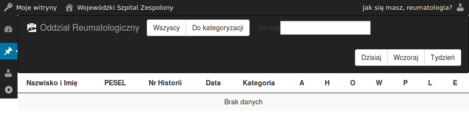 [9]Nawigacja po tabeli odbywa się poprzez przesuwanie paska po prawej stronie lub przy użyciu "kółka" na myszce.

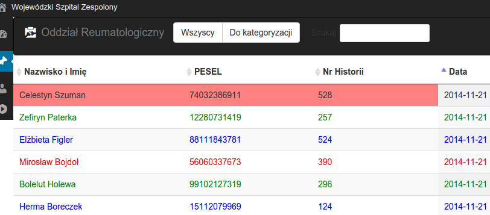 [10]Filtr pacjentów: (na górnym pasku)
- Wszyscy - wszyscy pacjenci na oddziale w danym dniu.
- Do kategoryzacji - wyświetla wyłącznie pacjentów jeszcze nie skategoryzowanych.
Wyszukiwanie:
Pole szukaj (na górnym pasku) umożliwia szybkie wyszukiwanie po nazwisku, peselu czy numerze historii.

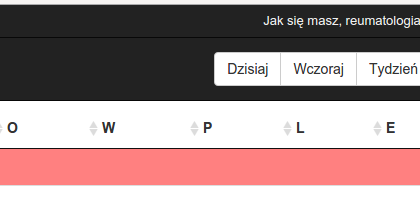 [11]Wybór daty: (prawy górny róg)
- Dzisiaj
- Wczoraj
- Tydzień - wyświetla pacjentów z całego tygodnia wraz z datami kategoryzacji.

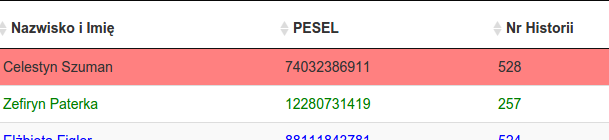 [12]Sortowanie:
Po kliknięciu na tytule w nagłówku tabeli (np. na "Nazwisko i Imię", "PESEL", "Kategoria") możemy posortować całą tabelę po danym polu.

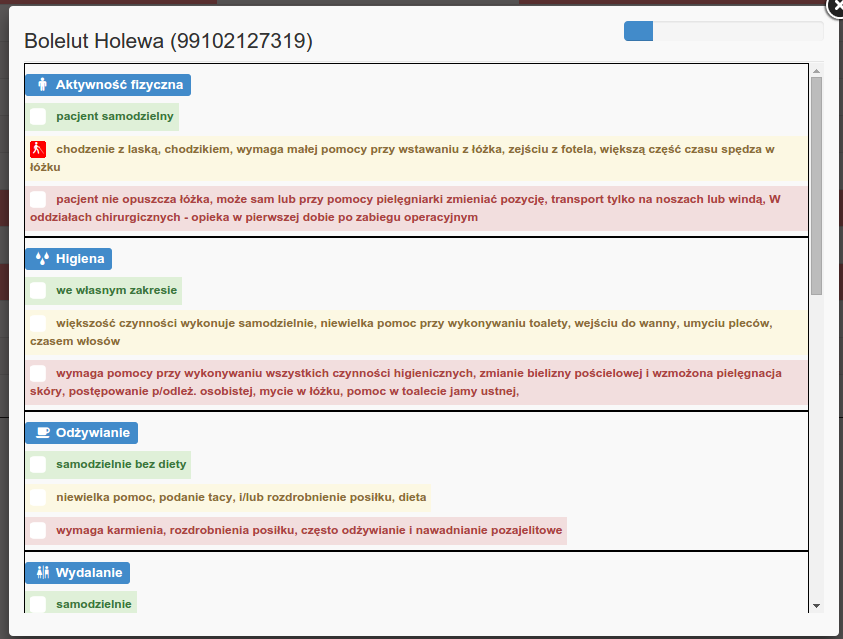 [13]Otwarcie formularza odbywa się przez kliknięcie na pacjencie w tabeli.

### Pacjent: Kategoryzacja
* * *
 [14]Nawigacja po formularzu podobnie jak w przypadku tabeli może odbywać sięprzy użyciu "kółka" myszy lub przesuwania prawego paska. Kategorię ustawiamy klikając na treści.

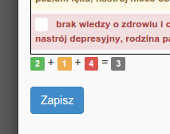 [15]Po wypełnieniu całego formularza kliknij na "Zapisz".Nad przyciskiem "Zapisz" znajduje się informacja o ilości kat. 1,2,3 i wyliczonej kategorii pacjenta.Sprawdź czy kategorie zostały odwzorowane w tabeli.

